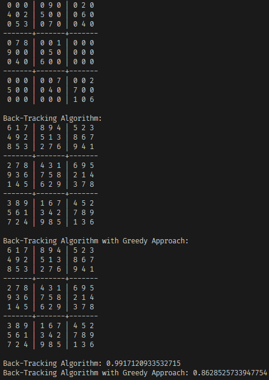

# Sudoku Solver

This is a personal project written in Python (mainly for practice) and in C++, capable to solve any sudoku board using different methods.

## Python

In Python I made a simple program, we input a 9x9 matrix into a function and it prints out the solution, if possible.

## C++

In C++ the program is capable of reading an incomplete sudoku board through a file, and prints out the respective solution if possible.